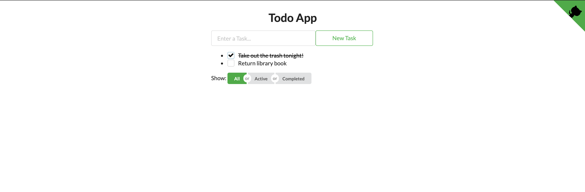

# todo-app 🗒

A todo task web app built as a [portfolio project](https://adamdubey.github.io/projects/2019-09-15-deploying-a-react-app-to-github-pages/). Enjoy!



## Installation

```
npm install
npm start
open http://localhost:3000 # if doesn't open on its own
```

## Frameworks

- [Create React App](https://facebook.github.io/create-react-app/)
- [React](https://reactjs.org/)
- [Redux](https://redux.js.org/)
- [Emotion](https://emotion.sh/)
- [Semantic UI](https://semantic-ui.com/)
